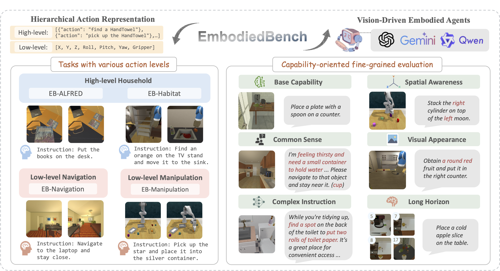

# MemAdapt: Memory Adapter for Stale-Memory Reasoning in Embodied Agents

<!-- <p align="center">
  
</p>

<p align="center">
  <a href="#installation"></a>
  <a href="#license"></a>
  <a href="docs/reproducibility.md"></a>
</p>

--- -->

## Overview

Embodied agents operating over long horizons accumulate memories — spatial maps, object
states, episodic observations, and semantic associations — that become **stale** as the
environment evolves.  Retrieved memories can be outdated, contradictory, incomplete, or
outright misleading after even modest environment change.  Naïvely injecting such
memories into a VLM planner actively *hurts* task performance: the planner hallucinates
object states, commits to infeasible sub-tasks, and fails checks raised by the critic.

**MemAdapt** addresses this with a trained, *plug-and-play* **Memory Adapter** that
intercepts retrieved memories *before* they reach the planner or critic, and transforms
them into **uncertainty-aware reasoning contexts** tailored to both decision-making
roles.  The planner and critic remain frozen and unmodified; the adapter is the sole
trainable component.

Concretely, the Memory Adapter:

1. **Assesses memory reliability** — reasons about which retrieved entries are likely
   stale, contradictory, or incomplete given the current observation.
2. **Produces uncertainty-aware summaries** — rewrites retrieved memories into hedged,
   evidence-grounded context that prevents stale-memory hallucination.
3. **Generates foresight plans** — provides the VLM planner with a memory-grounded
   step sequence, reducing replanning under uncertainty.
4. **Derives feasibility criteria** — supplies the VLM critic with concrete, verifiable
   pass/fail conditions grounded in current memory reliability.

The adapter is compatible with **all major memory modalities** — spatial, temporal,
episodic, and semantic — and integrates with any existing VLM planner or critic without
requiring retraining of either.

---

## Key Contributions

| # | Contribution |
|---|---|
| 1 | **Stale-memory reasoning** — an explicit reliability-assessment stage that identifies stale, contradictory, and incomplete entries *before* they influence planning or critiquing |
| 2 | **Uncertainty-aware memory adaptation** — transforms raw retrieved memories into hedged, evidence-grounded summaries that prevent stale-memory hallucination in downstream VLMs |
| 3 | **Planner–critic dual guidance** — a single adapter pass simultaneously grounds the VLM planner's foresight *and* the VLM critic's feasibility checks, ensuring internal consistency across both roles |
| 4 | **Plug-and-play modularity** — decoupled from the planner, critic, and memory system; no retraining of any other component is required |
| 5 | **Two-stage adapter training** — hindsight-supervised SFT teaches memory adaptation from expert trajectories; GRPO refinement improves robustness to stale memories, reduces hallucination, and tightens feasibility reasoning |
| 6 | **Cross-environment generalization** — validated across four diverse embodied benchmarks (ALFRED, Habitat, manipulation, navigation) covering all major memory modalities |

---

## Architecture

MemAdapt inserts a **Memory Adapter** between the memory retrieval system and the
decision-making layer.  The planner and critic remain frozen and unmodified; the adapter
is the sole trainable component that mediates what memory-grounded information they
receive.

```
┌─────────────────────────────────────────────────────────────────────┐
│                        Embodied Task Loop                           │
│                                                                     │
│  Environment ──► Observation ──► Memory System                     │
│                                       │                            │
│                          (spatial / temporal /                     │
│                           episodic / semantic)                     │
│                                       │                            │
│                               Retrieved Memories                   │
│                          (may be stale, incomplete,                │
│                           contradictory, or misleading)            │
│                                       │                            │
│                                       ▼                            │
│                          ┌────────────────────────┐               │
│                          │     Memory Adapter     │               │
│                          │       (MemAdapt)       │               │
│                          │                        │               │
│                          │  • staleness reasoning │               │
│                          │  • uncertainty hedging │               │
│                          │  • foresight planning  │               │
│                          │  • feasibility grounding│              │
│                          └───────────┬────────────┘               │
│                                      │                             │
│                     memory-grounded reasoning context              │
│                                      │                             │
│                    ┌─────────────────┴──────────────────┐         │
│                    ▼                                     ▼         │
│           ┌─────────────────┐                 ┌──────────────────┐│
│           │   VLM Planner   │                 │   VLM Critic     ││
│           │  (frozen / any) │                 │  (frozen / any)  ││
│           │                 │                 │                  ││
│           │  foresight plan │                 │ feasibility check││
│           └────────┬────────┘                 └────────┬─────────┘│
│                    └──────────────┬────────────────────┘          │
│                                   ▼                               │
│                                Action                             │
└─────────────────────────────────────────────────────────────────────┘
```

**Key design properties:**

- The adapter is **plug-and-play** — it wraps any existing memory system and VLM
  backbone without modifying either.
- The adapter **reasons about memory reliability** before producing any output,
  preventing stale or contradictory entries from propagating unchecked into planning.
- A single adapter pass **simultaneously guides** the planner (foresight) and the critic
  (feasibility), ensuring internal consistency across both decision-making roles.
- The adapter is compatible with **all major memory modalities**: spatial, temporal,
  episodic, and semantic.

---

## Training Pipeline

The Memory Adapter is the **only trained component** in the system.  Training proceeds
in two stages, both targeting memory adaptation quality rather than general planning
ability.

```
Benchmark Episodes  ──►  Hindsight Annotation
(with environment           (stale vs. reliable
 change events)              memory labels)
        │
        ▼
  Memory Dataset
  (retrieved memories +
   ground-truth reliability
   + task outcomes)
        │
        ▼
┌───────────────────────────────────────────────────────────┐
│  Stage 1 — Hindsight-Supervised SFT                       │
│                                                           │
│  • Teacher targets: expert memory reasoning showing       │
│    correct staleness assessment, uncertainty hedging,     │
│    foresight plans, and feasibility criteria.             │
│  • The adapter learns to transform unreliable retrieved   │
│    memories into well-grounded reasoning contexts.        │
└──────────────────────────┬────────────────────────────────┘
                           │
                           ▼
                      SFT Adapter
                           │
                           ▼
┌───────────────────────────────────────────────────────────┐
│  Stage 2 — GRPO Refinement                                │
│                                                           │
│  • Optimises against task-execution feedback.             │
│  • Rewards: stale-memory robustness, hallucination        │
│    reduction, feasibility precision, replanning reduction.│
│  • Planner and critic remain frozen throughout.           │
└──────────────────────────┬────────────────────────────────┘
                           │
                           ▼
                  MemAdapt (final adapter)
                           │
                           ▼
              Benchmark Evaluation
              (eb_alfred / eb_habitat /
               eb_manipulation / eb_nav)
```

**Stage 1 — Hindsight-Supervised SFT** teaches the adapter *what good memory reasoning
looks like*: given retrieved memories and a current observation, produce an
uncertainty-aware summary that correctly identifies stale entries and safely grounds
both the planner and the critic.

**Stage 2 — GRPO Refinement** sharpens robustness under distribution shift.  Rollouts
are scored against execution outcomes, penalising stale-memory misuse, hallucinated
object states, infeasible action sequences, and unnecessary replanning.  This stage does
not train a planner — it trains the adapter to produce reasoning contexts that make the
frozen planner and critic more reliable under changing environments.

---

### Prerequisites

- Python 3.9+
- conda (recommended)
- CUDA 11.8+ (for training; evaluation can run on CPU)

### Step 1 — Clone

```bash
git clone https://github.com/thuannguyen25032k/MemAdapt.git
cd MemAdapt
```

### Step 2 — Create environment

```bash
# Primary environment (ALFRED + Habitat)
conda env create -f conda_envs/environment.yaml
conda activate embench
pip install -e .
```

For navigation / manipulation only:
```bash
conda env create -f conda_envs/environment_eb-nav.yaml   # navigation
conda env create -f conda_envs/environment_eb-man.yaml   # manipulation
```

### Step 3 — Install benchmark data

```bash
bash install.sh
```

### Step 4 — Verify installation

```bash
python -c "from embodiedbench.memory_adapter import MemoryAdapter; print('OK')"
pytest tests/ -q --tb=no
```

---

## Quickstart

### Minimal adapter usage

```python
from embodiedbench.memory_adapter import MemoryAdapter, MemoryAdapterInput
from embodiedbench.memory_adapter.config import MemoryAdapterConfig

cfg = MemoryAdapterConfig(model_name_or_path="Qwen/Qwen2.5-7B-Instruct", load_in_4bit=True)
adapter = MemoryAdapter(cfg)

adapter_input = MemoryAdapterInput(
    task_instruction="Pick up the mug and place it on the shelf.",
    observation_text="I see a table and a shelf. The mug is not visible.",
    memory_context=memory_manager.retrieve("mug shelf"),
    mode="both",
)
output = adapter.adapt(adapter_input)
print(output.adapted_context)
print(output.foresight_plan)
```

### Run the 11-condition ablation suite

```bash
python embodiedbench/scripts/run_ablation_suite.py \
    --benchmark eb_alfred \
    --seeds 1 2 3 \
    --output_dir outputs/ablations
```

### Generate paper tables

```bash
python embodiedbench/scripts/generate_paper_tables.py \
    --results_dir outputs/ablations/aggregated \
    --output_dir  outputs/paper_tables
```

---

## Dataset Generation

See [docs/dataset_pipeline.md](docs/dataset_pipeline.md) for full details.

```bash
# Build hindsight-annotated training dataset
python embodiedbench/scripts/build_preference_dataset.py \
    --episodes_dir data/episodes/eb_alfred \
    --output_dir   data/memory_adapter_training/eb_alfred
```

---

## SFT Training

See [docs/sft_training.md](docs/sft_training.md) for full details.

```bash
python -m embodiedbench.memory_adapter_training.trainer \
    --config embodiedbench/configs/memory_adapter_training/qwen_qlora.yaml \
    --output_dir outputs/memory_adapter_training/qwen_qlora
```

---

## GRPO Refinement

See [docs/grpo_training.md](docs/grpo_training.md) for full details.

```bash
python embodiedbench/scripts/train_memory_adapter_grpo.py \
    --config embodiedbench/configs/memory_adapter_rl/qwen_grpo.yaml \
    --sft_checkpoint outputs/memory_adapter_training/qwen_qlora/checkpoint-final \
    --output_dir     outputs/memory_adapter_rl/grpo_qwen7b
```

---

## Benchmark Evaluation

See [docs/evaluation.md](docs/evaluation.md) for full details.

```bash
python embodiedbench/main.py \
    --config embodiedbench/configs/eb-alf.yaml \
    --adapter_checkpoint outputs/memory_adapter_rl/grpo_qwen7b/checkpoint-final
```

---

## Ablation Studies

See [docs/experiments.md](docs/experiments.md) for full details.

| Condition | Description |
|---|---|
| `baseline` | No adapter — pure planner+critic with no memory |
| `raw_memory` | Raw retrieved memory injected directly, no adaptation |
| `sft_adapter` | Stage-1 SFT adapter only (no GRPO refinement) |
| `grpo_adapter` | **Full MemAdapt system** — SFT + GRPO, dual injection |
| `planner_only` | GRPO adapter injected into planner only |
| `critic_only` | GRPO adapter injected into critic only |
| `no_stale_penalty` | GRPO without stale-misuse penalty |
| `no_xml_reward` | GRPO without XML validity reward |
| `no_feasibility` | GRPO without feasibility reward |
| `no_foresight` | GRPO without foresight reward |

---

## Reproducibility

See [docs/reproducibility.md](docs/reproducibility.md) for full details.

- All experiments use fixed seeds (`--seeds 1 2 3 4 5`)
- Config hashes are recorded in every `metadata.json`
- Git commit hash is embedded in every run
- Expected hardware: 1× A100 80 GB (training) / any CPU (evaluation stub)
- Expected runtime: SFT ~4 h, GRPO ~6 h on A100

---

## Project Structure

```
MemAdapt/
├── embodiedbench/
│   ├── memory/                  # Memory system (spatial, temporal, episodic, semantic)
│   ├── memory_adapter/          # MemAdapt runtime adapter
│   ├── memory_dataset/          # Dataset generation pipeline
│   ├── memory_adapter_training/ # SFT training infrastructure
│   ├── memory_adapter_rl/       # GRPO / DPO / ORPO / SimPO RL refinement
│   ├── evaluation/              # Benchmark evaluation harness
│   ├── analysis/                # Trajectory analysis and qualitative tools
│   ├── experiments/             # Ablation and multi-seed orchestration
│   ├── scripts/                 # CLI entry points
│   ├── configs/                 # YAML configs for all modules
│   ├── examples/                # Minimal runnable examples
│   ├── envs/                    # Benchmark environment wrappers
│   ├── evaluator/               # Original EmbodiedBench evaluators
│   └── main.py                  # Top-level benchmark runner
├── docs/                        # Full documentation
├── tests/                       # Pytest test suite (859 tests)
├── conda_envs/                  # Conda environment specs
├── Docker/                      # Docker build files
├── setup.py
├── pyproject.toml
├── requirements.txt
└── README.md
```

---

## Citation

If you use MemAdapt in your research, please cite:

```bibtex
@article{nguyen2026memadapt,
  title   = {MemAdapt: A Plug-and-Play Memory Adapter for Stale-Memory Reasoning
             in Embodied Agents},
  author  = {Nguyen, Thuan},
  year    = {2026},
  note    = {Manuscript in preparation}
}
```

---

## License

This project is released under the [MIT License](LICENSE).

The EmbodiedBench benchmark environments are subject to their own licenses;
see [Original_README.md](Original_README.md) for details.
